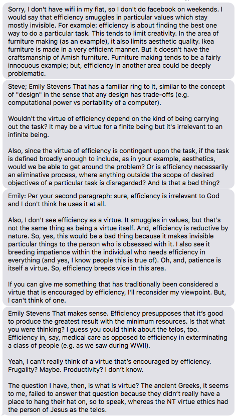

This post is a sidebar conversation and may be removed.

!!! Is *efficiency* a virtue?
===

!!! [Click here to view the history of this post in GitHub or to contribute.](https://github.com/cmadland/phd/commits/master/pages/01.blog/efficiency/item.md)

During her grad studies, my wife picked up the saying `Efficiency is not a virtue.` from one of her profs (I don't know if he is *actually* a Professor, but I'll presume for now).

To me, it seemed to make some intuitive sense in that there are times when it is clear that efficiency is not a virtue. But, I started to actually consider it, and the idea fell apart, like most slogans do. A few days ago we had a conversation about it, and I voiced my growing disagreement with it, leading to a conversation that she had on Mark Zuckerberg's panopticon. Here's the gist of the convo:

For a clear-cut example of efficiency used for evil, think about the Trump/Sessions policy of kidnapping asylum-seeking children at the southern US border. This is an extremely efficient way to destroy individual lives and families.

For a clear-cut example of virtuous efficiency, think of fuel efficiency in cars and trucks. Higher levels of fuel efficiency lead to fewer emissions, leads to reduced climate change, leads to fewer climate refugees.

Another example of virtuous efficiency: bicycles are among the most fuel-efficient machines humans have ever created. The charity https://worldbicyclerelief.org/en/ uses this efficiency to provide transportation to people living in rural regions of developing countries meaning that people now can transport their goods to previously inaccessible markets, children can ride their bikes to previously inaccessible schools, and the cycle of poverty is interrupted.

Also, re: furniture making. Ikea furniture is *intended to be produced efficiently*, thereby providing inexpensive furniture for families (virtuous efficiency). Amish furniture is *intended to be inefficiently produced*, thereby providing beautiful furniture for families who can afford it (virtuous inefficiency).

…AAAAaaaaand finally about efficiency limiting creativity. I completely disagree. The need to find sources of fuel more efficient than burning coal has led to significant advances in solar, wind, and tidal power generation. All applications of creativity driven by efficiency.

! Conclusion 1: it is true that efficiency is sometimes used for evil.

! Conclusion 2: it is true that efficiency is sometimes used for good.

! Conclusion 3: it is *not* true that efficiency is never a virtue.
